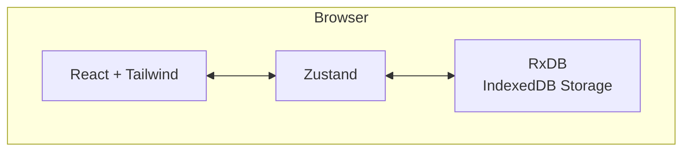

# Product Requirements Document – Construction Tasks Web-App

## 1. Overview

A responsive, **offline-first** web application that enables multiple field workers to manage construction tasks directly on a floor-plan. The tool must operate seamlessly with or without connectivity, persisting all data locally (RxDB + IndexedDB) and synchronising with a backend (future scope) when online.

## 2. Goals

1. Allow any user to log in with just a name ("login-light") and see **only** their own data.
2. Enable creation, editing and completion-tracking of tasks pinned to positions on a construction plan.
3. Provide an intuitive task board/list and a visual overlay of tasks on the floor-plan.
4. Guarantee full functionality while offline; data is stored locally and re-hydrated on reload.

## 3. Non-Goals

- Real authentication / password management.
- Multi-device synchronisation (will rely on RxDB replication in future iterations).
- Role-based permissions beyond simple user isolation.

## 4. Success Metrics

| Metric                                  | Target                   |
| --------------------------------------- | ------------------------ |
| First interaction to first task created | < 60 seconds             |
| Lighthouse PWA score                    | ≥ 85                     |
| Time-to-interactive (cold start)        | < 3 s on mid-tier mobile |
| Offline task creation/edit success rate | 100 %                    |

## 5. Personas & Key User Stories

- **Field Worker Frank** – needs to quickly log issues on site, even without connectivity.
  - _US-01:_ As Frank I can open the app and enter my name to start using it.
  - _US-02:_ As Frank I can click on the plan to create a task pinned to exact coordinates.
  - _US-03:_ As Frank I can update the checklist status while walking the site.
- **Site Manager Sarah** – reviews progress at the office with connectivity.
  - _US-04:_ As Sarah I see a list/board of all my tasks with their statuses.
  - _US-05:_ As Sarah I can edit or delete checklist items as requirements evolve.

## 6. Functional Requirements

1. **Login-Light**
   - Text input for user name; on submit, app initialises dedicated RxDB instance/collection key-scoped per user.
2. **Plan View**
   - Render supplied floor-plan image.
   - Click/tap to create new task → opens modal/form.
   - Badge/marker icons displayed on plan, colour-coded by aggregated checklist status.
3. **Task CRUD**
   - Title is mandatory.
   - Default checklist auto-populated from template (see Appendix A).
   - Checklist item status options: _Not started_, _In progress_, _Blocked_, _Final check awaiting_, _Done_.
4. **Task Board/List**
   - Responsive list & Kanban-style board toggle.
   - Filtering by status.
5. **Offline Capability**
   - All DB writes persisted to IndexedDB via RxDB Dexie storage.
   - UI gracefully indicates offline state (toast or banner).

## 7. Non-Functional Requirements

- **Performance:** <50 KB JS gzipped for initial load (excluding floor-plan image).
- **Accessibility:** WCAG 2.1 AA for all interactive elements.
- **Tech Compliance:** Latest React, React-Router, Zustand, RxDB (no RxDB sync helpers), Tailwind CSS, TypeScript strict.

## 8. Data Model (Version 1)

```ts
// User
{
  id: string;       // RxDB primary key
  name: string;
  createdAt: number;
}

// Task
{
  id: string;
  userId: string;           // owner
  title: string;
  x: number;                // position on plan (percentage 0-1)
  y: number;
  checklist: ChecklistItem[];
  createdAt: number;
  updatedAt: number;
}

// ChecklistItem
{
  id: string;
  text: string;
  status: 'not_started' | 'in_progress' | 'blocked' | 'final_check' | 'done';
}
```

## 9. System Architecture



_Future_: Add replication plugin → Sync Service.

## 10. Milestones

| ID  | Description                                         | ETA   |
| --- | --------------------------------------------------- | ----- |
| M1  | Project scaffolding, Tailwind, routing, state store | Day 1 |
| M2  | RxDB setup with user & task collections             | Day 1 |
| M3  | Login-light flow                                    | Day 1 |
| M4  | Plan view with image overlay & click coordinates    | Day 2 |
| M5  | Task CRUD + default checklist                       | Day 3 |
| M6  | Task board/list                                     | Day 3 |
| M7  | Offline indicator & PWA manifest                    | Day 4 |
| M8  | Unit & e2e tests, README, handover video            | Day 5 |

## 11. Risks & Mitigations

- **Accidental cross-user data leakage** → enforce per-user DB instances or use RxDB query-based isolation.
- **Large floor-plan image slow load** → lazy-load, compress to ≤ 200 KB.
- **Click coordinate accuracy on mobile** → use percentage relative coords & test across viewports.

## 12. Future Improvements

- Cloud sync via CouchDB/GraphQL endpoint.
- Role-based access (site manager vs worker).
- Image annotation & photo attachments.
- Notifications / reminders for blocked tasks.

---

### Appendix A – Default Checklist Template

1. Measure area
2. Gather materials
3. Rough installation
4. Quality inspection
5. Handover to QA
